<!--
  ============================================================================
  Devon Clark - GitHub profile README
  Content is real. No em dashes anywhere, by preference (hyphens instead).

  The graphics are all generated and self-contained (nothing loads from a third
  party): ascii.svg (the portrait), the stat SVGs, and the hd-*.svg section
  headings. See README-SETUP.md for how to finish + publish.

  A few links are marked EDIT-ME where a real URL isn't in yet (personal site,
  and the project repo links if any differ).
  ============================================================================
-->

**Devon Clark** 
<samp>Software Engineer &nbsp;·&nbsp; Graduating Nov 2026 &nbsp;·&nbsp; Perth, Australia</samp>

[linkedin](https://www.linkedin.com/in/devon-clark-22b235212/) &nbsp;·&nbsp;
[email](mailto:devonclark.contact@gmail.com)

> Software Engineering student at Curtin University. 
> Software Engineering Intern at Visagio. 
> Business Lead at the Perth Aerospace Student Team.

I like building reliable systems and shipping real tools with a team. Graduating 
November 2026 (Software Engineering, Curtin University, WAM ~90). Business Lead at 
the [Perth Aerospace Student Team](https://github.com/PerthAerospaceStudentTeam),
previously Software 2IC leading a 10+ engineer team. Focused on AI 
engineering: workflow improvements, context engineering, and provably safe, 
reliable systems. Seeking a 2026 graduate software engineering role.

**Curtin University** &nbsp;·&nbsp; Software Engineering, graduating Nov 2026 &nbsp;·&nbsp; <samp>WAM ~90</samp> 
Relevant coursework: Design and Analysis of Algorithms, Data Structures and 
Algorithms, Distributed Computing, Operating Systems, Object-Oriented Software 
Engineering, Mobile App Development.

**Dean's Award for Science, Best Second Year Student (2025)** &nbsp;·&nbsp; <samp>Curtin University</samp> 
Curtin's most outstanding student across academics, community, extracurriculars, 
and leadership; selected from 2,000+ students across 16 disciplines.

**Most Outstanding Second Year Student in Software Engineering (2025)** &nbsp;·&nbsp; <samp>Curtin University</samp>

**1st Place, EcoPulse Hackathon 2025** &nbsp;·&nbsp; <samp>Civic Hackers x Aramco x Curtin</samp> 
Led a team of 5 to first in the most competitive category, building a 
visualisation toolkit helping microgrid operators adopt renewables.

**Intern Poster Showcase Award, ACS WA Tech Summit 2026** 
For ["How can we prove an agentic AI system is accurate enough to trust?"](https://membership.acs.org.au/member-insight/2026-06-30-ACS-WA-Tech-Summit-2026.html)

**Letters of Commendation, Dean of Engineering and Science** &nbsp;·&nbsp; every semester 
<samp>S1 2024, S2 2024, S1 2025</samp>

**languages** &nbsp; <samp>C#, Java, Python, C, TypeScript, JavaScript</samp> 
**frameworks** &nbsp; <samp>.NET, Spring Boot, FastAPI, React, Angular, Flutter</samp> 
**cloud, infra, ai** &nbsp; <samp>AWS Lambda, AWS Bedrock, AWS Strands, Azure, Terraform, Docker, MCP</samp> 
**also** &nbsp; <samp>Tailwind CSS, PostgreSQL, GitHub Actions</samp>

**[canary-mcp](https://github.com/devon-clarkk/canary-mcp)** &nbsp;·&nbsp; <samp>typescript, node, mcp</samp> 
An MCP server that detects context rot and silent model degradation in long 
AI-agent conversations, using layered verification signals.

**[prosperity4-backtesting-suite](https://github.com/devon-clarkk/prosperity4-backtesting-suite)** &nbsp;·&nbsp; <samp>python, docker</samp> 
A team-friendly GUI backtesting runner for the IMC Prosperity 4 quant challenge.

**[Ground Station](https://github.com/PerthAerospaceStudentTeam/Ground-Station)** (PAST) &nbsp;·&nbsp; <samp>python, docker, mqtt, protobuf</samp> 
Containerised ground station ingesting and visualising live telemetry over 
MQTT and LoRa.

**[CurtinHonestly](https://github.com/devon-clarkk/CurtinHonestly)** &nbsp;·&nbsp; <samp>angular, spring boot, postgresql, azure</samp> 
Full-stack platform for anonymous Curtin unit reviews, deployed on Azure with CI/CD.

**[Perth Aerospace Student Team](https://github.com/PerthAerospaceStudentTeam)** &nbsp;·&nbsp; <samp>Business Lead (previously Software 2IC)</samp> 
As Software 2IC, oversaw 10+ software engineers across 5 concurrent projects; 
migrated the team from standups to full agile; ran recruitment, interviewing and 
onboarding each semester.

**IMC Prosperity 4** 
Built shared backtesting tooling so the team could iterate quickly.

Building a persistent, graph-based agentic AI memory system (private for now), 
plus CurtinHonestly and others. Deepening context engineering and provably 
reliable AI systems. Open to 2026 graduate software engineering roles:
[devonclark.contact@gmail.com](mailto:devonclark.contact@gmail.com).

